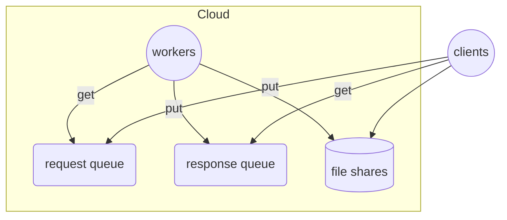
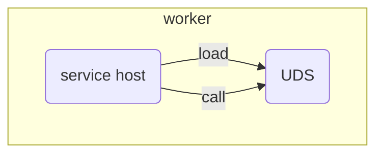
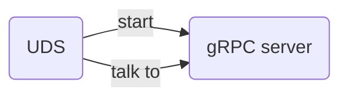

# CloudWorker

## Overview

CloudWorker is for a queue based system on cloud for [embarrassingly parallel](https://en.wikipedia.org/wiki/Embarrassingly_parallel) workload. CloudWorker provides runtime components for such a system and also tools for building it on cloud. CloudWorker itself is in .NET and the system can run on Linux or Windows.



The system is composed of a cluster of workers, a pair of messaging queues and file shares. Clients put request messages into the request queue and get response messages from the response queue, while the workers get requests from the request queue and put responses into the response queue. File shares are optional. They can be used for files of user service, which the workers depend on.

Though for now only Azure is supported, CloudWorker is also designed for on-premises and thus on other cloud. It makes this by abstractions in interface.

### Worker

A worker is a process that consumes requests and produces responses. Its input comes from the request queue and its output goes into the response queue. Each worker works independently of others.

A worker is composed of a service host and a User Defined Service (UDS). The UDS is the real message processor.



### User Defined Service (UDS)

A UDS is a C# class that implements the following interface:

```cs
interface IUserService : IAsyncDisposable
{
    Task InitializeAsync(CancellationToken cancel);

    Task<string> InvokeAsync(string input, CancellationToken token)
}
```

The `input` is the content of a message from the request queue and the returned string will be the content of a message into the response queue.

Though a UDS is in C#, it can be implemented to support other programming languages, like Java, Python, etc.

For example,



Here a UDS starts a gRPC server and then talks to it (such a UDS is an adapter between the service host and the real user service). The gRPC server can be implemented in whatever programming language.

## Build

CloudWorker is in .NET 8. Build it with standard .NET tools.

With [.NET CLI](https://learn.microsoft.com/en-us/dotnet/core/tools/), build it like

```bash
dotnet build
```

from the `src` directory.

## Usage

CloudWorker provides runtime components for a queue based system, and also tools for building the whole system on Azure.

### Runtime Components

The following runtime components are provided

* [`ServiceHost`](src/ServiceHost/)
* [`ServiceInferface`](src/ServiceInterface/)
* Official services [`Echo`](src/Services/Echo/), [`CGI`](src/Services/CGI/) and service adapter [`GRpc`](src/Services/GRpc/) (more to be added, like adapter for WCF)
* [Queue abstractions `IMessageQueue`, `IQueueMessage` and implementations for Azure Service Bus queue and Azure Storage queue](src/MessageQueue/)

With these runtime components, users can build their own systems on Azure, on premises or in a mixed way. For example, users can make use of Azure Service Bus queues, while running service hosts on premises.

See the following examples about using the runtime components

* [`SendAndReceive`](src/Samples/QueueClient/SendAndReceive/) A basic example on sending requests to and receiving responses from queues.
* [`PerfTest`](src/Samples/QueueClient/PerfTest/) An example of sending requests and receiving responses in a high performance way.

Besides, please note that you don't have to use C# for your client and service code

* On client side, you can use whatever programming languages that can read and write the queues. For example, you can use Python SDK for Azure Service Bus queues. Or you can use Azure Service Bus REST API directly, without the SDK.
* On service side, you can choose  `GRpc` or `CGI` as UDS and then use your favorite programming languages for the real service code.

### Building on Azure

CloudWorker provides tools for building the whole system on Azure, including

* C# [SDK](src/Client/SDK/)
* Local API Server for multiple programming languages (todo)

Examples

* [`Cluster`](src/Samples/SDK/Cluster/) Create, update or destroy a system on Azure, using `Cluster` class in C# SDK.
* [`Session`](src/Samples/SDK/Session/) Create, update or destroy a system on Azure, and send and receive messages for Echo/GRpc services, using `Session` class in C# SDK.
