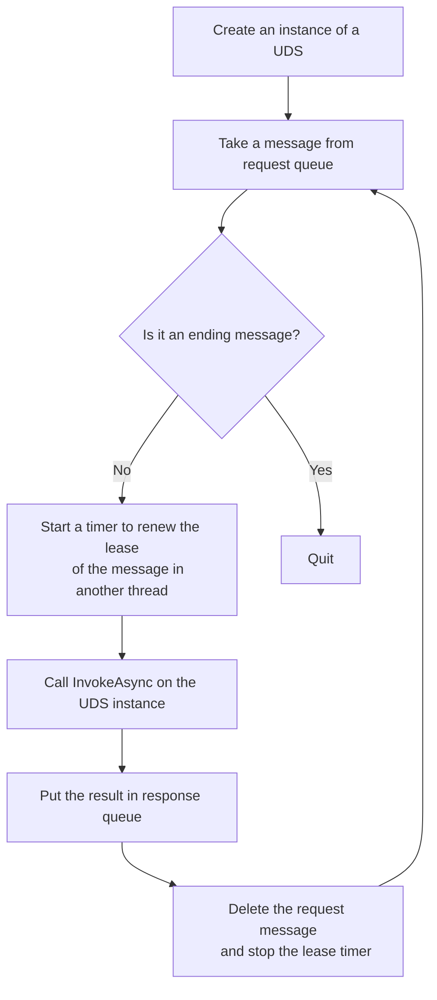

# Cloud Native SOA

## Service

### Used Defined Service (UDS)

A UDS is an implementation of the following interface:

```cs
interface IUserService
{
    Task<string> InvokeAsync(string json, CancellationToken token)
}
```

### Service Host

A service host is the one that hosts a UDS.

It works like this:



## Client

In the client side:

```cs
var storageAccount = ...;

//The primary goal of a config is to specify a servie assembly file: where to get it and where to put it on a service host. A config also specifies data volumes and where to mount them on a service host.
var config = new SimpleSoa.SessionConfig(...);

//A session consists of a pair of request and response queues, and file shares in a storage account.
//Each session has a unique ID, and optionally other fields like created_at, started_at, completed_at, etc..
var session = await SimpleSoa.Session.CreateAsync(storageAccount, config);

//Then you can get the queue and volume info of a session. You need to provide them to service hosts for your BYO cluster. For a HOBO cluster, do it like the following.

//Create a cluster for a session with 100 nodes. The method returns when cluster provisioning begins.
var cluster = await SimpleSoa.Cluster.CreateAsync(session, 100);

//You can query the cluster status by
//await cluster.GetStatusAsync();

//While the cluster is creating, you can submit requests to the session now!
for (var i = 1; i < 10000; i++) {
    //Alternatively, you can collect all tasks into an array and wait for them all at once
    //to get much more throughput.
    await session.SendRequestAsync(jsonString);
}

//Completing a session means marking the end of a request queue, so that service hosts won't try to get
//more tasks from the queue. Service hosts will shutdown themselves in the end.
//After completing you can not add task the the job any more. You must call CompleteAsync when no more
//request, otherwise the cluser will keep busy polling the queue.
await session.CompleteAsync();

//A session's status can be created, [started,] and completed. Optionally it can include numbers of pending requests and responses, and time stamps like created_at, [started_at] and completed_at.

//You can query session status by
//await session.GetStatusAsync();

//Get responses in a session
while (true) {
    //Optioanlly, we can get a batch of responses by GetResponsesAsync
    var response = await session.GetResponseAsync();
    if (!response) {
        var status = await session.GetStatusAsync();
        if (status.Completed) {
            break;
        }
        else {
            //The requests are being processed and no new response for now.
            //So wait for some time.
            Sleep(2000);
        }
    }
    else {
        //Process the response...
    }
}

//For BYO cluster, you stop/reset it when session is completed.
//For a HOBO cluster of containers, you must destroy it when session is completed.
await cluster.DestroyAsync()

//For a session, file shares remain when it's completed, so that you can check log files or output data in them.
```

Questions:

1. Do we save session into a storage table? And what about requests and response?

   That depends. And also note the performance penalty for saving these records.

2. How about logging, diagnosis and visibility? What do we provide for user for those?

   User can write their own log in files on volume. And ...?

3. Last but not least, do we need to support multiple programming languages? And how to?

   We may need things like gRPC for multi-languages. And for C#, we support it natively.
