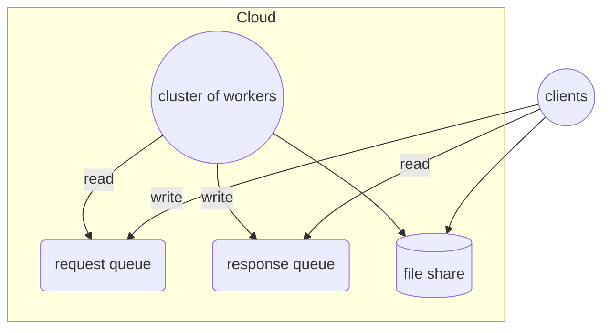
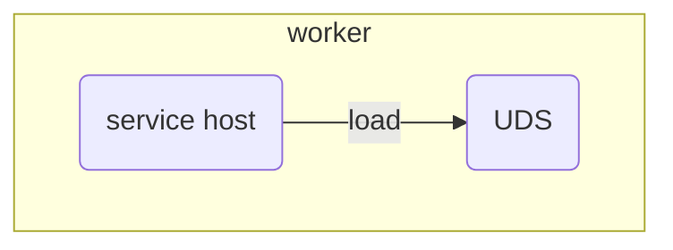
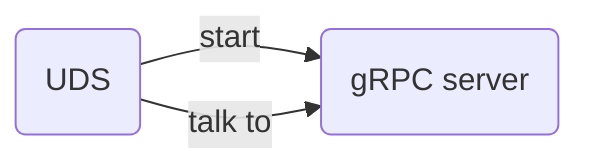
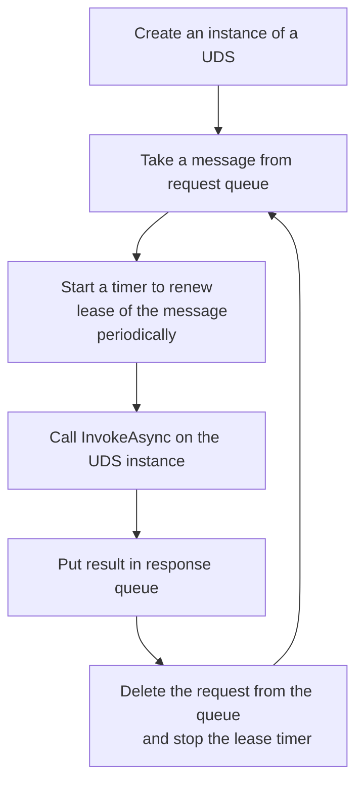

# CloudWorker

## Overview

CloudWorker is a queue based system on cloud for [embarrassingly parallel](https://en.wikipedia.org/wiki/Embarrassingly_parallel) workload.



A worker is composed of a service host and a User Defined Service (UDS).



### User Defined Service (UDS)

A UDS is a C# class that implements the following interface:

```cs
interface IUserService : IAsyncDisposable
{
    Task InitializeAsync(CancellationToken cancel);

    Task<string> InvokeAsync(string input, CancellationToken token)
}
```

The `input` is whatever a user puts in a message of a request queue and the returned string will be the content of a response message.

Though a UDS is in C#, it can be extended/implemented to support other programming languages, like Java, Python, etc.

For example,



Here a UDS starts a gRPC server and then talks to it. The gRPC server can be implemented in whatever programming language.

### Service Host

A service host is a process that hosts a UDS. It works like this:



## Implementation

An implementation of Azure is provided, though the core abstraction/interfaces can be implemented in a different cloud infrastrutrue.

### Control Plane Operations

Control plane operations are used to build a cloud infrastructure of the system.

The main components of the system's infrastructure are:

* Queue (Service Bus queue/Storge queue/...)
* Cluster (ACI/AKS/...)
* Storage (Azure Storage file share/...)
* Monitor (Azure Monitor/...)

Hereafter PowerShell is used to describe the control plane operations.

#### Components

Create a pair of queues for requests and responses separately

```ps1
//Create a queue space with two queues, named after "requests" and "responses" separately.
$queueSpace = New-QueueSpace ...
New-Queue -Space $queueSpace -Name "requests"
New-Queue -Space $queueSpace -Name "responses"
```

Create a file share for user service(UDS) and data

```ps1
$fileShare = New-FileShare ...
New-FileShareFile -LocalPath "local-user-service-package-path" -TargetPath "fileshare-path"
```

Create monitoring resources for clusters

```ps1
$monitor = New-Monitor ...
```

Create one or more clusters with the pair of queues, file share and monitor

```ps1
$queueConfig = { $queueSpace.ConnectionString, "requests", "responses", ... }
$fileshareConfig = { $fileShare.ConnectionString, "fileshare-path", "target-mount-path", ... }
$serviceConfig = { "service-assembly-path", ... }
$monitorConfig = { $monitor.ConnectionString, ... }
$clusterConfig = @{
    queue = $queueConfig
    fileShare = $fileConfig
    service = $serviceConfig
    monitor = $monitorConfig
    dockerImage = '...'
    nodes = 100
    ...
}
$cluster = New-Clsuter $clusterConfig
```

### Data Plane Operations

Data plane operations are used to run user workload against a built-up cloud infrastructure.

After a UDS is deployed to the cloud infra, user can send requests to and get responses from it.

Send requests to request queue

```cs
var requestQueueClient = ...;
var tasks = new Task[1000];
for (var i = 1; i < 1000; i++) {
    tasks[i] = requestQueueClient.sendAsync(...);
}
await Task.WhenAll(tasks);
```

Get responses from response queue

```cs
var responseQueueClient = ...;
for (var i = 1; i < 1000; i++) {
    var result = await responseQueueClient.WaitAsync()

    //Process the result...

    //Delete the result message finally
    await result.DeleteAsync();
}
```
