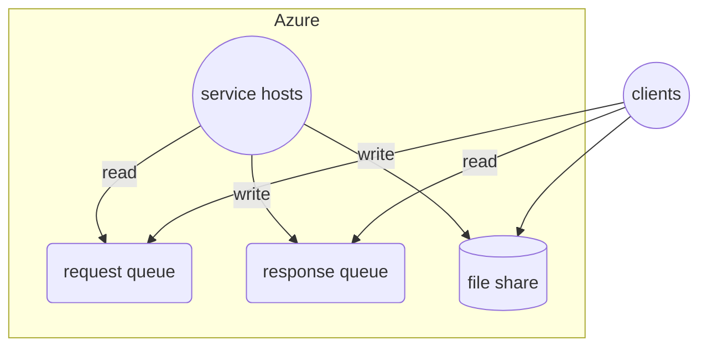
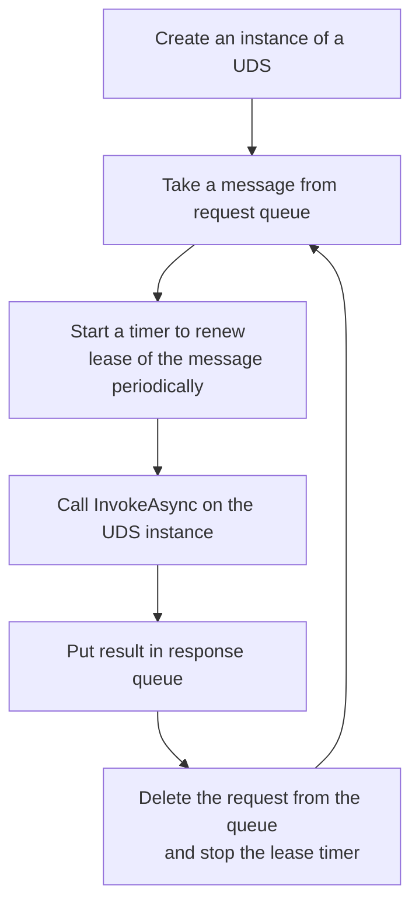

# Cloud SOA

## Overview

Cloud SOA is a queue based system on Cloud for SOA workload.



## Service

### Used Defined Service (UDS)

In the system, a SOA service is a Used Defined Service (UDS) that implements the following interface:

```cs
interface ISoaService
{
    Task<string> InvokeAsync(string input, CancellationToken token)
}
```

### Service Host

A service host is the one that hosts a UDS.

It works like this:



## Client

### Control Plane/Cloud Resource Operations

Create a pair of queues for requests and responses separately

```cs
//Create a queue space with two queues, named after "requests" and "responses" separately.
var queueSpace = QueueSpace.Create(...);
queueSpace.CreateQueue("requests", ...);
queueSpace.CreateQueue("responses", ...);
```

Create a file share for user service and data

```cs
var fileShare = FileShare.Create(...);
fileShare.upload("local-user-service-package-path", "fileshare-path");
```

Create monitoring resources for clusters

```cs
var monitor = ResourceMonitor.Create(...);
```

Create one or more clusters with the pair of queues, file share and monitor

```cs
var queueConfig = { queueSpace, "requests", "responses", ...};
var fileshareConfig = { fileShare, "fileshare-path", "target-mount-path", ... };
var serviceHostConfig = { "user-service-path", ... } ;
var cluster = Clsuter.Create(queueConfig, fileshareConfig, serviceHostConfig, monitor, ...);
```

Besides, a key vault is used when providing secrets such as queue space connection strings in a deployment

```cs
var kv = await KeyVault.Create(...);
```

### Data Plane Operations

Send requests to request queue

```cs
var requestQueueClient = ...;
var tasks = new Task[1000];
for (var i = 1; i < 1000; i++) {
    tasks[i] = requestQueueClient.sendAsync(...);
}
await Task.WhenAll(tasks);
```

Get responses from response queue

```cs
var responseQueueClient = ...;
for (var i = 1; i < 1000; i++) {
    var result = await responseQueueClient.WaitAsync()

    //Process the result...

    //Delete the result message finally
    await result.DeleteAsync();
}
```
