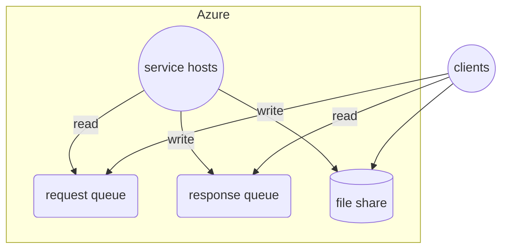
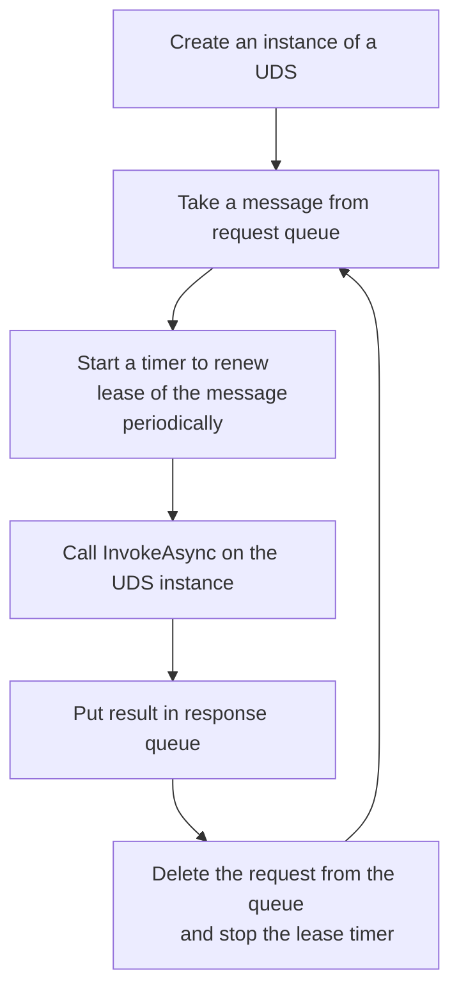

# Cloud Native SOA

## Overview

Cloud SOA is a queue based SOA system on Azure.



## Service

### Used Defined Service (UDS)

In the system, a SOA service is a Used Defined Service (UDS) that implements the following interface:

```cs
interface ISoaService
{
    Task<string> InvokeAsync(string input, CancellationToken token)
}
```

### Service Host

A service host is the one that hosts a UDS.

It works like this:



## Client

**Create a session**

Queues and cluster are created externally to a session.

```cs
var requestQueue = await Queue.CreateAsync(...);
var responseQueue = await Queue.CreateAsync(...);
var cluster = await Cluster.CreateAsync(...);
var session = await Session.CreateAsync(requestQueue, responseQueue);
```

Question: do we really need a session, since the request and response queues are enough for sending requests and receiving responses?

**Send requests by the session**

```cs
var tasks = new Task[1000];
for (var i = 1; i < 1000; i++) {
    tasks[i] = session.sendRequestAsync(...);
}
await Task.WhenAll(tasks);
```

**Get responses by the session**

```cs
for (var i = 1; i < 1000; i++) {
    var result = await session.WaitResponseAsync()

    //Process the result...

    //Delete the result message finally
    await result.DeleteAsync();
}
```
