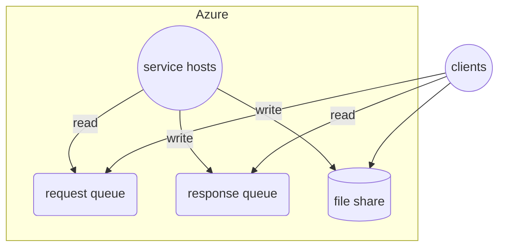
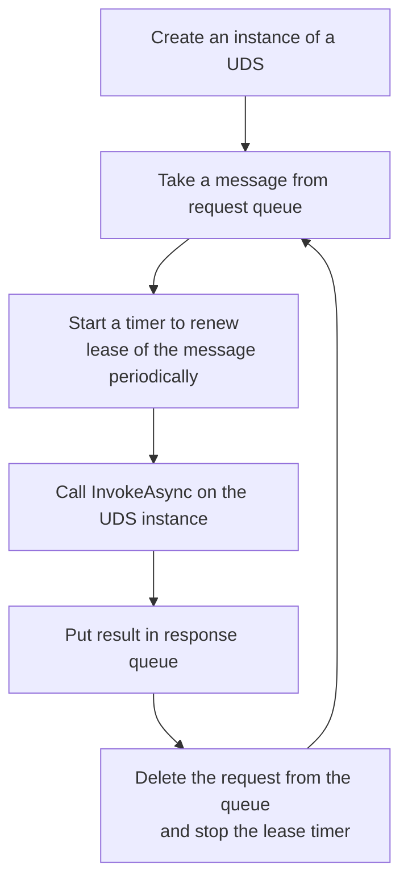

# Cloud SOA

## Overview

Cloud SOA is a queue based system on Cloud for SOA workload.



## Service

### Used Defined Service (UDS)

In the system, a SOA service is a Used Defined Service (UDS) that implements the following interface:

```cs
interface ISoaService
{
    Task<string> InvokeAsync(string input, CancellationToken token)
}
```

### Service Host

A service host is the one that hosts a UDS.

It works like this:



## Client

### Control Plane Operations

Create a pair of queues for requests and responses separately

```cs
var requestQueue = await Queue.CreateAsync(...);
var responseQueue = await Queue.CreateAsync(...);
```

Create one or more clusters for the pair of queues

```cs
var cluster = await Clsuter.CreateAsync(requestQueue, responseQueue, ...);
```

### Data Plane Operations

Send requests to request queue

```cs
var requestQueueClient = ...;
var tasks = new Task[1000];
for (var i = 1; i < 1000; i++) {
    tasks[i] = requestQueueClient.sendAsync(...);
}
await Task.WhenAll(tasks);
```

Get responses from response queue

```cs
var responseQueueClient = ...;
for (var i = 1; i < 1000; i++) {
    var result = await responseQueueClient.WaitAsync()

    //Process the result...

    //Delete the result message finally
    await result.DeleteAsync();
}
```
